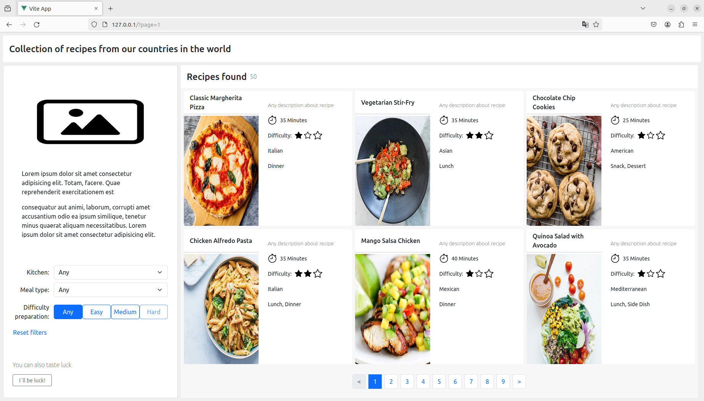
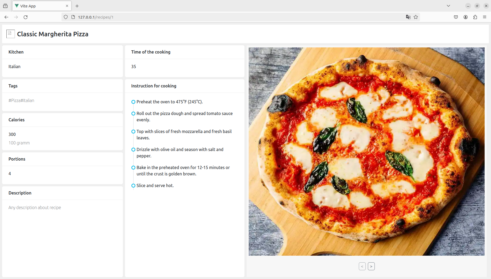

## Preview

This application provides a graphical user interface over a ready external recipes API.
This *Home-page* contains all of the recipes and filters from selections.

<picture>
  
</picture>

Tis is a *Detail-page* witch contains the detail information about a selected recipe.

<picture>
  
</picture>

## Installation

1) Clone this repository

  ```bash
  git clone https://github.com/PavelKrivorotov/task_07_05_2024.git
  ```

## Usage

1) Build docker image in work directory:

 ```bash
 docker build -t vue-project .
 ```

2) Run container in work directory:
  
  ```bash
  docker run -p 80:80 vue-project
  ```

3) Open this url adress in browser:

  ```bash
  http://127.0.0.1:80
  ```
